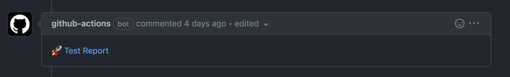

## About

GitHub Action to publish reports and notify back the URL where the reports are stored to..

___

* [Usage](#usage)
  * [Configuration](#configuration)
* [Customizing](#customizing)
  * [inputs](#inputs)
* [Keep up-to-date with GitHub Dependabot](#keep-up-to-date-with-github-dependabot)
* [Fleet UI](#fleet-ui)

## Usage

### Configuration

Given the report generator on a PR basis:

```yaml
---
name: ci

on:
  pull_request:

permissions:
  contents: read

jobs:
  generate:
    timeout-minutes: 5
    runs-on: ubuntu-latest
    steps:
      ...

      - name: Save PR number
        run: echo ${{ github.event.number }} > NR
      - uses: actions/upload-artifact@v3
        with:
          name: report
          path: '*'
```

Then, let's create a new workflow to upload the reports to a Google bucket and notify the result

```yaml
---
name: Publish Report
on:
  workflow_run:
    workflows: [ ci ]
    types: [ completed ]

jobs:
  publish_results:
    timeout-minutes: 5
    runs-on: ubuntu-latest
    ## on a PR basis only for now
    if: (github.event.workflow_run.conclusion != 'skipped' && github.event.workflow_run.event == 'pull_request')
    permissions:
      pull-requests: write
      actions: read
    steps:
      - uses: elastic/apm-pipeline-library/.github/actions/publish-report@current
        with:
          globFiles: '**/*.html'
          artifact: 'report'
          index: 'index.html'
          vaultUrl: ${{ secrets.VAULT_ADDR }}
          vaultRoleId: ${{ secrets.VAULT_ROLE_ID }}
          vaultSecretId: ${{ secrets.VAULT_SECRET_ID }}
          vaultSecret: secret/your-team/ci/your-google-bucket-secrets
          bucket: your-bucket
          token: ${{ secrets.GITHUB_TOKEN }}

```



## Customizing

### inputs

Following inputs can be used as `step.with` keys

| Name              | Type    | Default                     | Description                        |
|-------------------|---------|-----------------------------|------------------------------------|
| `globFiles`       | String  |                             | What glob files to be uploaded     |
| `artifact`        | String  |                             | The artifact name that contains the files to be published |
| `index`           | String  |                             | The relative path to the `index.html` or similar to be highlighted in the report |
| `vaultUrl`        | String  |                             | The Vault URL to connect to. |
| `vaultRoleId`     | String  |                             | The Vault role id. |
| `vaultSecretId`   | String  |                             | The Vault secret id. |
| `vaultSecret`     | String  |                             | The Vault Secret with the format { service-account :"foo" }. |
| `bucket`          | String  |                             | The Google bucket where to upload the files to. |
| `token`           | String  |                             | The GitHub token used to comment out the URL with the report. |
