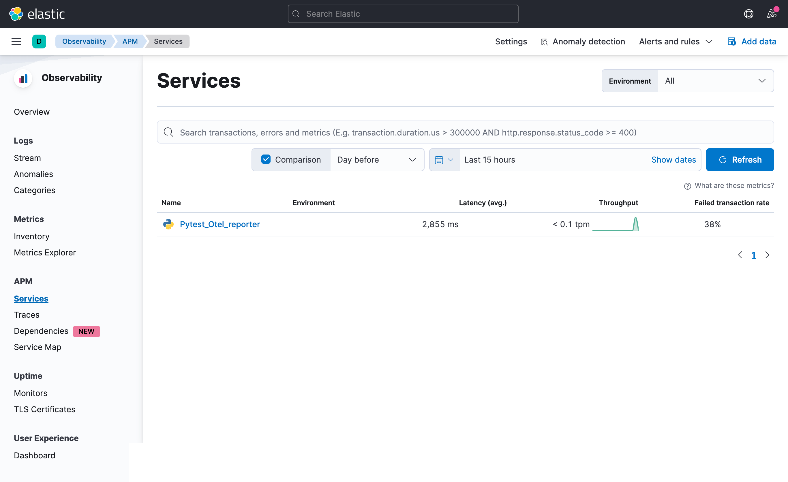
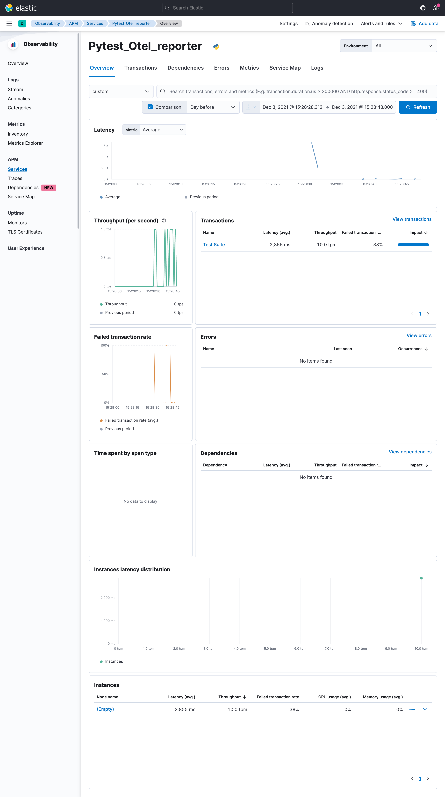
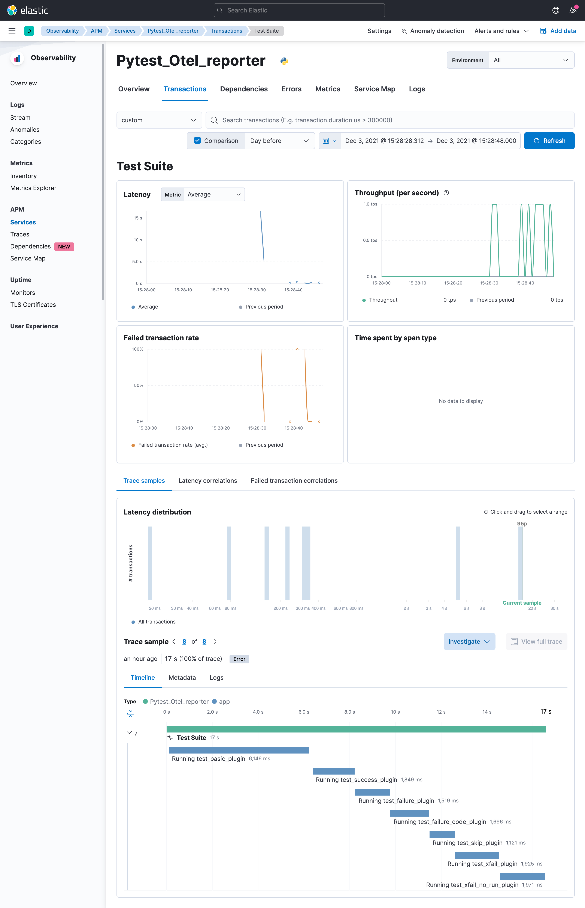

# Elastic Stack demo

In this demo we start an APM service,
to show how to send the OpenTelemetry spans to an APM Service.
Then we start the pytest-otel tests with the environment variables configured to hit the APM service.

To start the demo you have to execute the following command in the root of the pytest-otel project folder:

```shell
make demo-start-elastic
```

When the execution ends you can go to the Kibana service (http://localhost:5601/) in a browser to show the spans








Finally you can stop the demo

```shell
make demo-stop-elastic
```

* [OpenTelemetry](https://opentelemetry.io/docs/)
* [APM app](https://www.elastic.co/guide/en/kibana/current/xpack-apm.html)
* [APM Server](https://www.elastic.co/guide/en/apm/get-started/current/overview.html)
* [Elasticserach](https://www.elastic.co/guide/en/elasticsearch/reference/current/elasticsearch-intro.html)
* [Kibana](https://www.elastic.co/guide/en/kibana/current/introduction.html)
