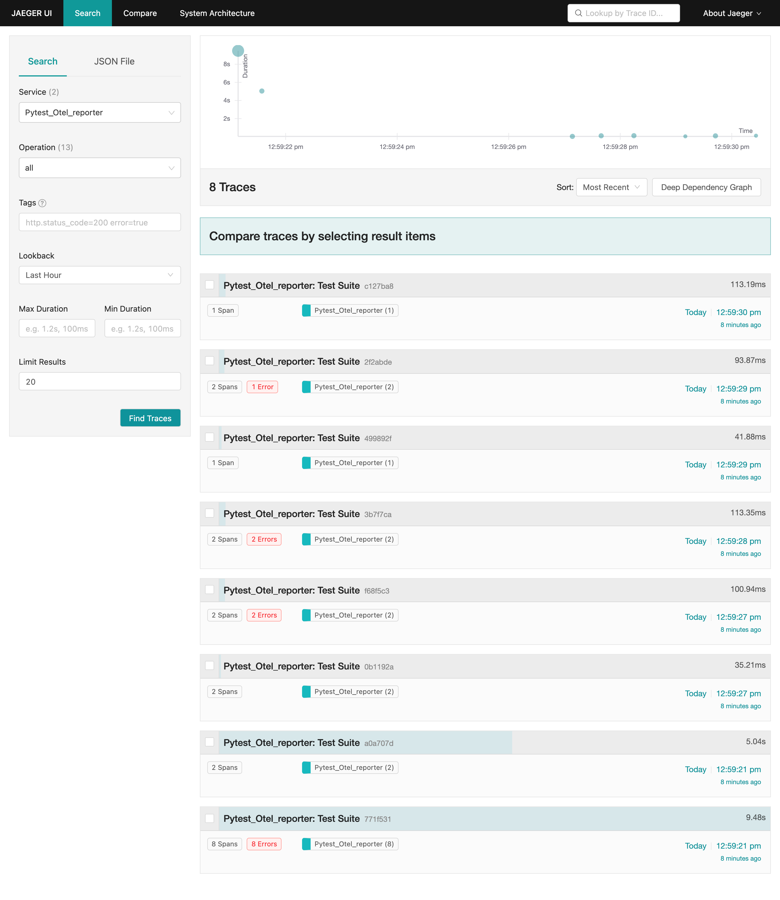
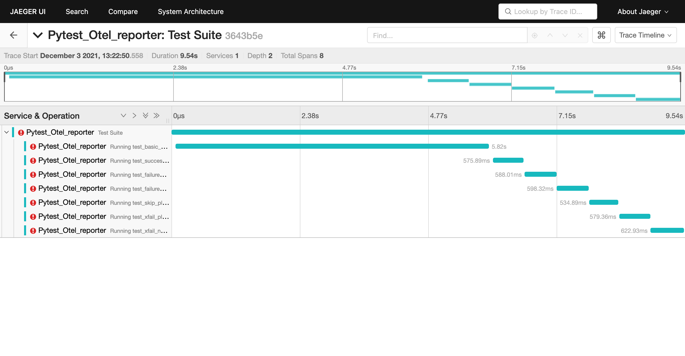
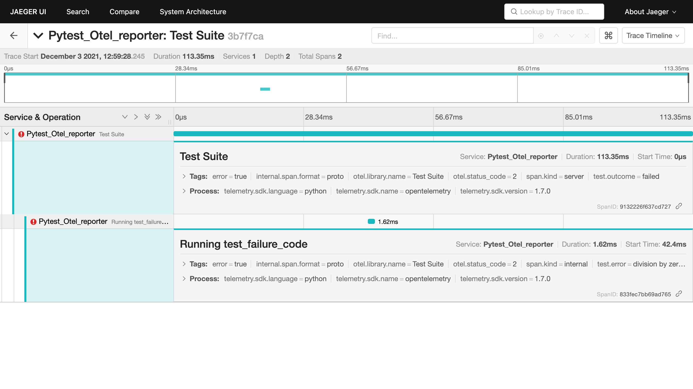

# Jaeger demo

In this demo we start an OpenTelemetry collector using the Jaeger exporter and a Jaeger service,
to show how to send the OpenTelemetry spans to a Jaeger service.
Then we start the pytest-otel tests with the environment variables configured to hit the OpenTelementry collector service.

To start the demo you have to execute the following command in the root of the pytest-otel project folder:

```shell
make demo-start-jaeger
```

When the execution ends you can go to the Jaeger service (http://localhost:16686/) in a browser to show the spans







Finally you can stop the demo

```shell
make demo-stop-jaeger
```

* [OpenTelemetry](https://opentelemetry.io/docs/)
* [OpenTelemetry Collector](https://opentelemetry.io/docs/collector/)
* [Jaeger](https://www.jaegertracing.io/docs/)
